# # 📚 Shoneko - Sistema de Gestión de Librería Online


## 📖 Descripción
**Shoneko** es una plataforma web para la venta y administración de libros. Desarrollada bajo el patrón de arquitectura **MVC (Modelo-Vista-Controlador)**, garantiza una separación limpia entre la lógica de negocio, la interfaz de usuario y los datos. El sistema cuenta con dos entornos totalmente diferenciados: una tienda pública para clientes y un panel de administración privado.

---

## 🚀 Características Principales

* **Arquitectura Escalable:** Estructura de carpetas modular (Controllers, Models, Views).
* **Seguridad:** Validación de sesiones, encriptación de contraseñas y protección contra inyecciones SQL básicas.
* **Gestión de Estados:** Control de stock en tiempo real y estados de pedidos.

---

## 📸 Recorrido Visual: Experiencia del Cliente

La plataforma guía al usuario desde la exploración hasta la compra.

### 1. Página de Inicio
Vista principal atractiva donde se destacan las novedades y promociones actuales.
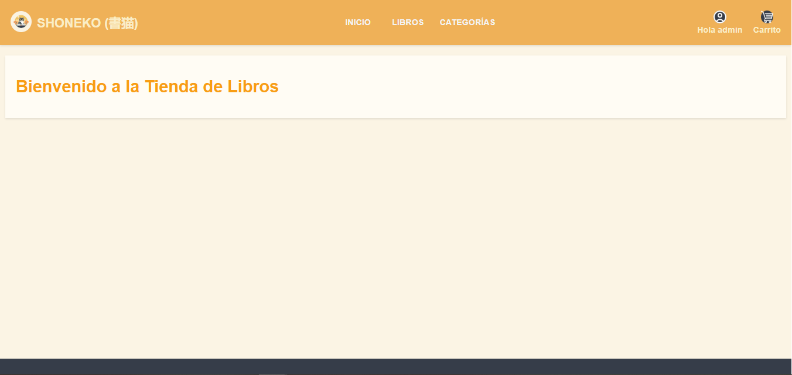

### 2. Catálogo
Navegación con búsqueda.
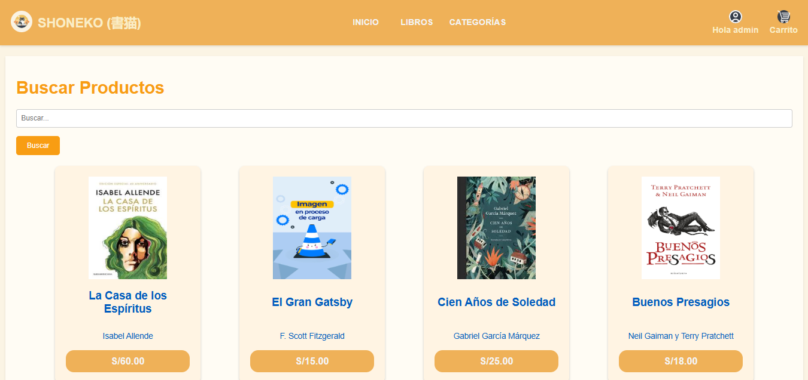

### 3. Catálogo con Categorías
Navegación filtrada por géneros literarios para facilitar la búsqueda.
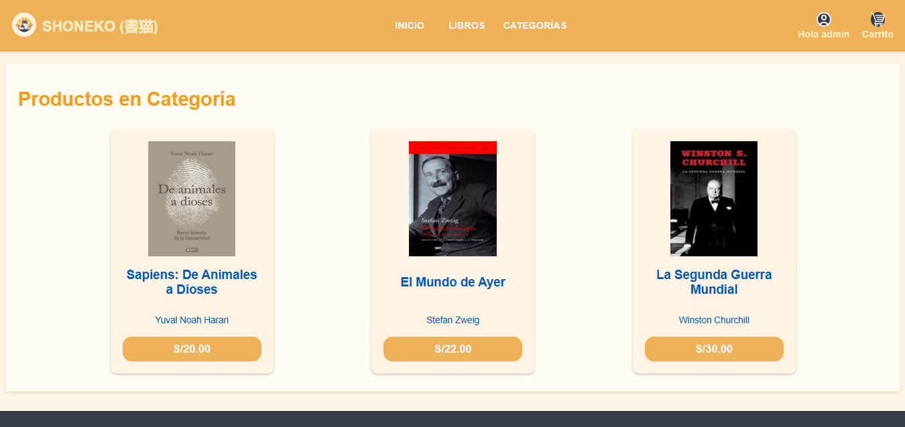

### 4. Detalle del Libro
Ficha técnica completa con sinopsis, autor, precio y disponibilidad de stock.
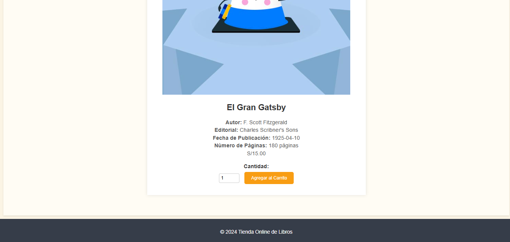

### 4. Carrito de Compras
Gestión dinámica de los ítems seleccionados. Permite actualizar cantidades o eliminar productos antes de pagar.
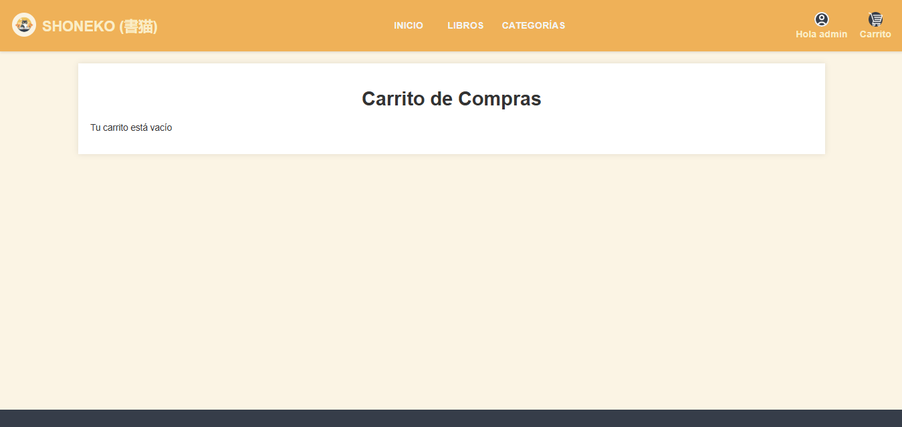
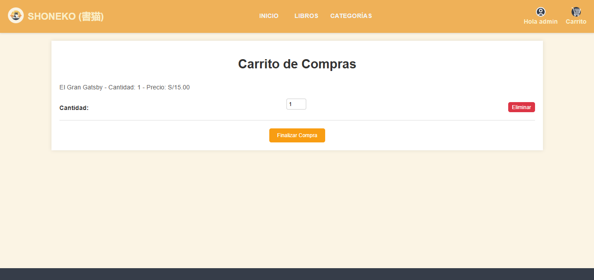

### 5. Inicio de Sesión (Login)
Acceso seguro para usuarios registrados.
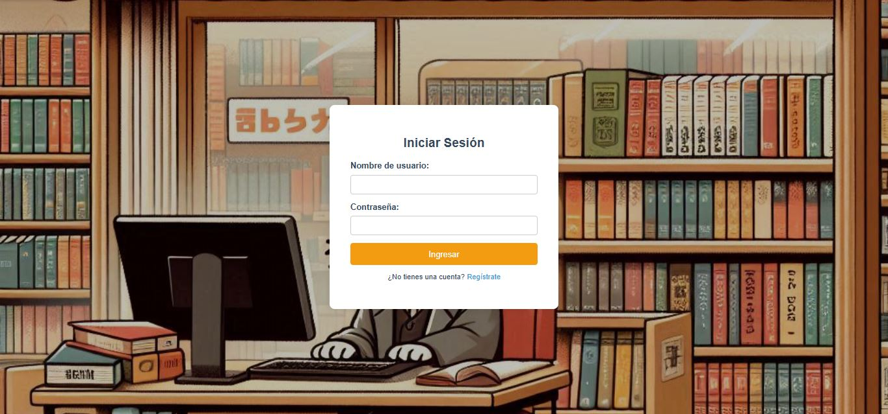

### 6. Registro de Nuevos Usuarios
Formulario para la creación de cuentas de clientes.
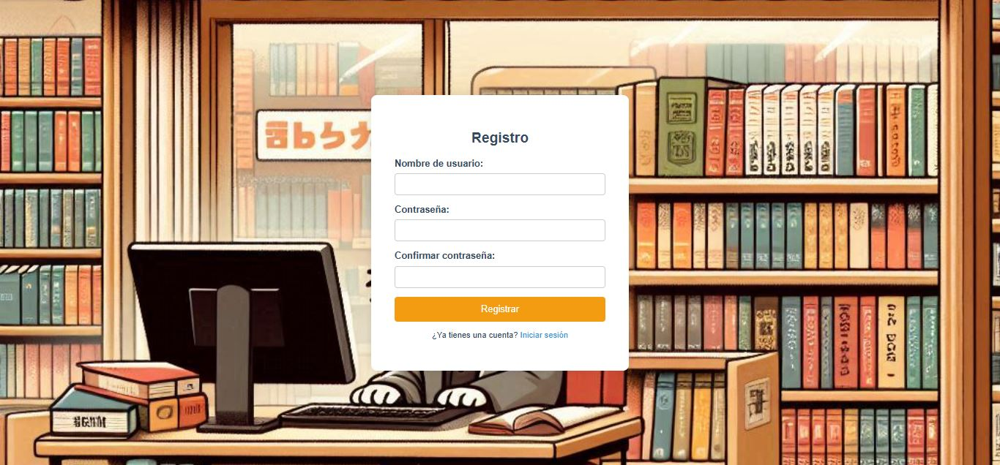

### 7. Perfil de Usuario / Historial
Espacio donde el usuario gestiona sus datos.
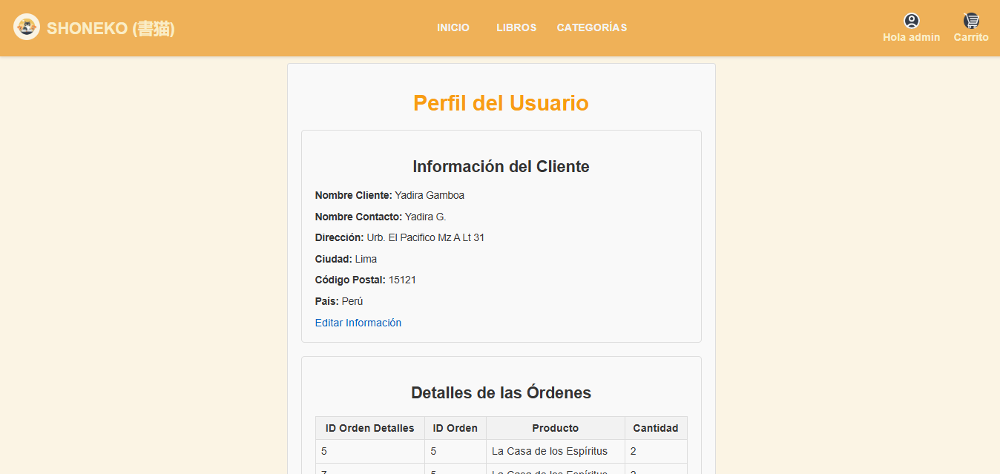

### 8. Actualización de Información de Usuario
Formulario para la actualización de información de clientes.
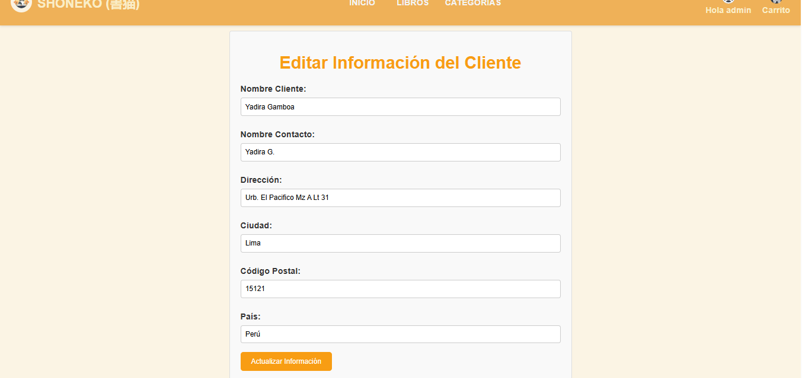

### 9. Proceso de Checkout / Confirmación
Resumen final del pedido antes de confirmar la compra.


---

## 🛠️ Panel Administrativo (Backoffice)

Área restringida para la gestión integral del negocio.

### 10. Dashboard General
Vista panorámica del estado del sistema y accesos rápidos.
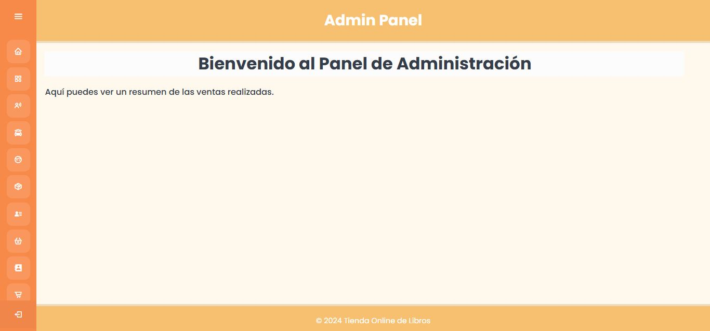


### 11. Gestión de Inventario y Productos
Tabla CRUD (Crear, Leer, Actualizar, Borrar) para administrar el catálogo de libros, precios y stock.
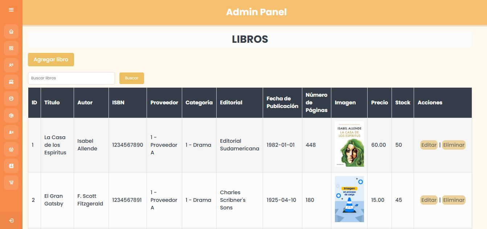
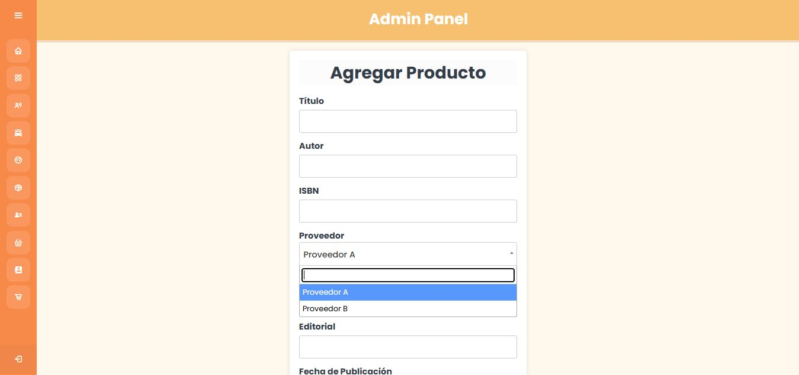

---

## 💻 Tecnologías Utilizadas

| Categoría | Tecnología |
|Info|---|
| **Lenguaje Backend** | PHP 8 Nativo |
| **Base de Datos** | MySQL |
| **Frontend** | HTML5, CSS3, JavaScript|
| **Servidor Local** | XAMPP / Apache |
| **Control de Versiones** | Git & GitHub |

---

## 🔧 Instalación y Despliegue

Sigue estos pasos para ejecutar el proyecto en tu entorno local:

1.  **Clonar el repositorio:**
    ```bash
    git clone [https://github.com/tu-usuario/tienda_online_libros_mvc.git](https://github.com/tu-usuario/tienda_online_libros_mvc.git)
    ```

2.  **Base de Datos:**
    * Abre phpMyAdmin.
    * Crea una base de datos llamada `negociosdb`.
    * Importa el archivo `database/negociosdb.sql` incluido en el proyecto.

3.  **Configuración:**
    * Verifica las credenciales en `includes/db.php` (Por defecto: User `root`, Pass `""`).

4.  **Ejecución:**
    * Abre tu navegador y ve a: `http://localhost/tienda_online_libros_mvc`

---

## ✒️ Autores

* **Yadira Gamboa** - *Desarrollo Full Stack & Documentación*
    * [GitHub](https://github.com/yadiragamboa05)

---
*Proyecto desarrollado con fines educativos para el curso de Programación Web.*